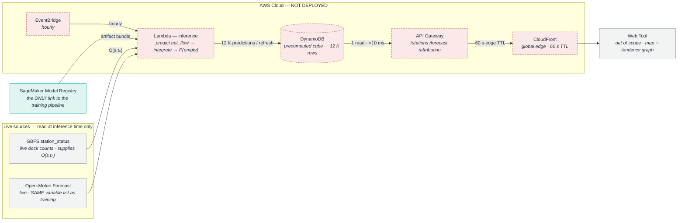

# Indego Station Capacity Prediction

Modelling the effect of **weather** and **time of day / day of week** on dock capacity at Indego bikeshare stations in Philadelphia.

> **Result (2026-09-18):** temporal factors account for **24.4%** of attributed
> effect, weather for **5.4%** — time beats weather roughly 4.5 to 1, and both
> sit behind the station's own recent history at 57.5%. Test MAE **0.5070**
> against a 0.5581 baseline. Full write-up in **[`docs/REPORT.md`](docs/REPORT.md)**;
> the presentation is **[`docs/Team7_StationBalance_Final.pptx`](docs/Team7_StationBalance_Final.pptx)**.

This repository builds a **pre-trained model** from historical data. Nothing in it reads a live feed, serves a prediction, or runs on a schedule. Real-time inference is a design deliverable only — see [`docs/live_inference.drawio`](docs/live_inference.drawio).

---

## 1. Objective

Quantify how external factors drive dock availability at each Indego station:

1. **Weather** — temperature, precipitation, wind, cloud cover
2. **Temporal** — hour of day, day of week, holidays, daylight

The deliverable is a **registered model bundle**: the trained model, the feature
contract it was trained under, its test metrics, and the SHAP attribution per
factor group. Attribution is the research question, not a by-product of
prediction.

### Street closures — cut

A third factor, permitted lane closures near the station, was scoped and then
dropped. PGW is the only source with real closure history, and it publishes
each closure as a bare text address with no coordinates. Turning ~108 K of
those into points needs a street-name normaliser and a street-centerline range
join that do not exist, and the work is open-ended against a fixed date.

Rather than ship a closure feature that is mostly noise, the arm is cut and
this project measures **two factors, not three**. That is stated here, in
`features.yaml`, and in every model's `metrics.json`, rather than implied by a
column of zeros. The rationale is recorded in `.claude/decisions.md`.

---

## 2. Architecture

Two diagrams, deliberately separate, because they describe two different things:

| File | What it is |
|---|---|
| **[`docs/pretrained_model.drawio`](docs/pretrained_model.drawio)** | **Built and deployed.** The batch training pipeline: download archives → process → train → register. Every input is historical. |
| **[`docs/live_inference.drawio`](docs/live_inference.drawio)** | **Not built.** What would exist if real-time inference were added, and how live data would interact with the trained model. |

Both render inline below. GitHub does not display `.drawio` files in a README,
so each diagram is mirrored here as Mermaid — which renders on load, diffs like
code, and needs no hosted page. The `.drawio` files remain the detailed source:
open either in the draw.io desktop app, <https://app.diagrams.net>, or the VS
Code *Draw.io Integration* extension.

### Built — the batch training pipeline

```mermaid
flowchart LR
    subgraph SRC["Historical sources — downloaded once, never re-fetched"]
        direction TB
        S1["Indego Trip Archives<br/><i>quarterly ZIP · 5.31 M trips · 2022 Q1+</i>"]
        S2["Indego Station Table<br/><i>CSV · station_id, go-live date</i>"]
        S3["Open-Meteo Historical Forecast<br/><i>hourly · 4 grid points, not 354 stations</i>"]
    end

    subgraph AWS["AWS Cloud — us-east-1"]
        direction LR
        LAM["Lambda<br/><i>ingest · 3 tasks</i>"]
        S3D[("Amazon S3<br/><i>raw · parsed · clean</i>")]
        EMR["EMR Serverless<br/><i>Spark · no pre-init capacity</i>"]
        S3M[("Amazon S3<br/><i>training splits · models</i>")]
        SM["SageMaker<br/><i>LightGBM · Processing · ml.t3.xlarge</i>"]
        REG["SageMaker Model Registry<br/><i>model + features.json + metrics</i>"]

        subgraph SUP["Supporting"]
            direction TB
            GLUE["Glue Data Catalog<br/><i>hand-written DDL · no crawler</i>"]
            ATH["Athena<br/><i>QA gates · ledger diagnostics</i>"]
            CW["CloudWatch<br/><i>logs · budget alarm</i>"]
        end
    end

    SRC --> LAM
    LAM -->|"land to raw/"| S3D
    S3D <-->|"read · write parsed / clean"| EMR
    EMR -->|"training splits"| S3M
    S3M -->|"9.44 M rows × 22 features"| SM
    SM -->|"model + metrics + SHAP"| REG
    EMR -.->|catalogs| GLUE
    GLUE -.->|QA gates| ATH

    classDef src fill:#F2F3F3,stroke:#879196,color:#232F3E
    classDef store fill:#E8F4E4,stroke:#277116,color:#232F3E
    classDef compute fill:#FDEBDD,stroke:#D05C17,color:#232F3E
    classDef ml fill:#E0F5F1,stroke:#01A88D,color:#232F3E
    classDef ops fill:#EFE7FB,stroke:#4D27AA,color:#232F3E

    class S1,S2,S3 src
    class S3D,S3M store
    class LAM,EMR compute
    class SM,REG ml
    class GLUE,ATH,CW ops
```



**Nothing is on a schedule.** No EventBridge rule exists in this account, and
`scripts/00_preflight.sh` asserts the schedule count is zero. Ordering comes
from the numbered scripts in `scripts/`, not from an orchestrator, because
every run is attended.

### Not built — what live inference would look like



**None of this exists in the account** — no DynamoDB table, no API Gateway, no
EventBridge rule, no endpoint. The model is *not* on the request path: a
precomputed cube is served instead, because 354 stations × 48 hours is ~17 K
predictions that fit in one batch refresh.

The split is the point. Everything that touches a live feed — GBFS
`station_status`, the live weather forecast, DynamoDB, API Gateway, CloudFront —
lives in the inference diagram and **only** there. The training pipeline has no
live input, no schedule, and no serving path. Keeping them in one picture is
what let live-data machinery creep into a historical-attribution project in the
first place.

The only thing crossing from one to the other is the model bundle itself.

Three constraints the training diagram exists to make explicit:

| Constraint | Why it matters |
|---|---|
| Storage is drawn as prefixes with `EMR Serverless` looping through them | The read-transform-write cycle is where phases 2–5 actually live; one opaque store hides it |
| Nothing is on a schedule | Every run is attended. There is no EventBridge resource in the account, and `scripts/00_preflight.sh` asserts that |
| The model is registered, not served | The deliverable is the bundle in the SageMaker Model Registry. No endpoint, no API, nothing warm |

**Sizing and cost.** EMR Serverless at driver 4 vCPU / 14 GB and two executors at 4 vCPU / 14 GB, dynamic allocation off, `preInitializedCapacity` **0** — 12 vCPU and 42 GB, inside both the application cap and the account's 16 vCPU quota (L-D05C8A75), ~$1–2 per pipeline run. The sizing is passed explicitly in `scripts/20_run_phase.sh`; left to the image defaults, Spark requests executors past the cap and decorates every run with warnings that look like failures. SageMaker phase 6 on one `ml.t3.xlarge`, ~$0.60 per run. The canonical path is a Training job on one `ml.m5.4xlarge` at ~$0.25, and `scripts/30_train.sh` still is that path — but every `ml.* for training job usage` quota in this account is **0**, in every region, so the executed run is a **Processing** job via `scripts/31_train_processing.sh` (same service, same role, same image, same unmodified `train.py`; 4 burstable vCPU instead of 16, so hours instead of ~20 min). See `.claude/decisions.md`. At rest this is S3 storage and nothing else, well under $1/month. Every meaningful cost risk is something *left running*: a NAT Gateway ($32/mo), a managed MLflow tracking server (~$460/mo), or pre-initialised EMR capacity. None are provisioned.

---

## 3. Scale and Tooling Rationale

State this explicitly, because it will be questioned.

Figures below are **measured from the landed data** on 2026-09-18 — counted by
phases 1 and 2, not derived from archive sizes. The earlier estimates taken
from `indego_capacity_data_sources.csv` are superseded; where they differ, the
run is right.

| Quantity | Measured |
|---|---|
| Trip records published, 2022 Q1 – 2026 Q2 | **5,307,135** (18 quarterly archives, 107 MB zipped / 700 MB CSV) |
| Trip records after phase 2 | **5,096,494** (210,641 dropped, 3.97% — window, duration bounds, pseudo-station) |
| Trip *events* (arrivals + departures) | **~10.2 M** |
| Stations | **367** (368 published, minus `Virtual Station`) |
| Hours in window | **39,440** (2022-01-01 → 2026-07-02, from the trip bounds; the weather pull covers 41,323) |
| Station-hour modelling grid | **10,818,141 rows** — 367 × 39,440 is 14.5 M before the go-live filter removes the years a station did not yet exist |
| Total storage footprint | **~3–5 GB** |

This is a **modest** volume. At ~22 features the grid is roughly 2 GB in
memory, so the modelling table still fits on a single machine — the phase-6
instance has 64 GB.

Distributed processing is justified by:

1. **Step 3.1** — a global sort-and-window over the entire trip history partitioned by `bike_id`. This is the genuine shuffle-heavy stage and the peak memory consumer. Note that 5.1 M rows is not, on its own, Spark-scale.
2. **The architectural requirement of the project itself.** This is the honest primary justification and should be stated as such.

It is **not** justified by raw input size. Be honest about this rather than overstating the data volume — a reviewer who checks the numbers should find them conservative, not inflated.

---

## 4. Data Sources

Full machine-readable inventory: **`indego_capacity_data_sources.csv`** (17 sources, endpoints, formats, auth requirements, caveats). Three of them are used.

| Source | Role |
|---|---|
| Indego Trip Data (quarterly CSV) | Complete event log of ridden movement. Basis of all label construction. |
| Indego Station Table (CSV) | `go live date`, required in 3.4 so pre-launch stations are not scored as zero-demand |
| Open-Meteo Historical Forecast | Weather features for the training window |

Everything else in the inventory is either a **live feed** — GBFS
`station_status`, GBFS `station_information`, the live Open-Meteo forecast, the
current-state ArcGIS closure layer — or part of the cut closure arm. Live feeds
belong to `docs/live_inference.drawio`. None is downloaded here.

All three retained sources are `Auth Required: No`, which is why there is no
Secrets Manager in the architecture.

### Two gaps worth stating plainly

**There is no published historical archive of dock-level occupancy.** GBFS
`station_status` is a live snapshot only. The label must therefore be
reconstructed from trip data — see section 5.

**There is no published historical capacity either.** Stations have been
resized and only the current dock count is available, from a live feed this
project does not use. Capacity is therefore derived from the reconstructed
occupancy itself (step 3.7), which is self-consistent but means `pct_full` is
an estimate, not a measurement.

---

## 5. Method

### The label problem

There is no published historical archive of dock-level occupancy — GBFS `station_status` is a live snapshot only. The label is therefore reconstructed from trip data by chaining each bike's trips on `bike_id`: where a bike's next trip starts at a different station from where its last trip ended, a van moved it, and a `reb_out` / `reb_in` pair is emitted.

This yields **two tiers of label**:

| Tier | Variable | Error |
|---|---|---|
| **Tier 1** | `net_flow(s,t)` = `arr − dep` | **Zero.** Counted directly from trip endpoints |
| Tier 2 | `O(s,t)`, `pct_full`, `is_empty` | Estimated — a cumulative ledger plus a solved initial condition |

**Train on Tier-1 `net_flow`.** It is counted rather than reconstructed, so reconstruction error never enters the learned weights, and predicting the *change* is exactly what weather and time drive. Tier 2 is retained as an input feature and as the basis of the `is_empty` classifier.

`O(s,0)` is one unknown scalar per station. The original design pinned it with `0 ≤ O ≤ capacity`, taking the midpoint of the feasible interval — but that needs a published capacity, and the only source was a live feed. So the lower constraint alone is used: `O(s,0) = −min(cumulative delta)`, the smallest start that keeps occupancy non-negative. **The level is therefore a lower bound rather than a centred estimate. The shape of the series, which is what the features predict, is unaffected.** Capacity is then the rolling 90-day maximum of the result, which is self-consistent by construction.

### The pipeline

Six phases, run in order, by hand.

| Phase | Does | Watch out for |
|---|---|---|
| **1 · Land** | Trip ZIPs, station CSV, weather JSON → Parquet | Nothing is cleaned here; that is phase 2's job, so a bad filter rule can be fixed without re-downloading |
| **2 · Conform** | Normalise schema, localise timestamps, filter, dedupe; conform the station table | DST breaks any naive local-time join. Timestamps are published `M/d/yyyy H:mm`, so an implicit `to_timestamp` nulls every row and the window filter then drops them **silently** — step 2.2 asserts the parse rate for exactly this. The trip archives carry **no station-name column**, so `Virtual Station` must be excluded by id sourced from the station table, not by name |
| **3 · Labels** | Bike trajectories, rebalancing events, station-hour grid, `net_flow`, occupancy ledger | Must be a **single global pass** — partitioning by quarter injects a false rebalance every 3 months |
| **4 · Features** | Weather join, calendar features, lags | The leakage audit is a hard stop, not a warning |
| **5 · Assembly** | Wide table, **chronological** split, class weights | Never random-split — it leaks future weather and inflates metrics |
| **6 · Train** | Baseline, `net_flow` regressor, `is_empty` classifier, tune, evaluate, attribute | Evaluate on test exactly once; attribution is a deliverable, not a by-product |

Phases 1–5 run on EMR Serverless; phase 6 on SageMaker. Ordering comes from the numbered scripts in `scripts/`, not from an orchestrator — every run is attended, and a numbered script lets you stop halfway and inspect.

### No inference pipeline

There is no second pipeline. The model is registered and that is the end of the deliverable.

What a live inference path would have to honour — the identical feature list and order from `features.json`, calendar features from `pipelines/calendarfeat.py` rather than a reimplementation, and live `station_status` supplying only the integration constant `O(s,t₀)` — is drawn in `docs/live_inference.drawio`. `calendarfeat.py` is deliberately Spark-free so that path could import the same file.

### The attribution result

The research question, answered. Mean absolute SHAP per factor group over a
20,000-row test sample:

| Factor group | mean \|SHAP\| | Share of total effect |
|---|---|---|
| lag (autoregressive history) | 0.275912 | 57.5% |
| **temporal** | 0.117231 | **24.4%** |
| station_static (capacity) | 0.060464 | 12.6% |
| **weather** | 0.026006 | **5.4%** |

**Time of day and day of week dominate weather by roughly 4.5 to 1.** Both are
dwarfed by the station's own recent history, which is expected and is not a
finding about external factors — `net_flow_same_hour_last_week` alone is the
single largest feature in every run.

**These numbers come from `station-balance/2`, not from the registered
deliverable.** That is deliberate, and it is the one place in this project
where the model that is served and the model that is measured are different
objects:

- The deliverable (`station-balance/1`, `models/current/`) trains with
  `regression_l1`. It wins on MAE — 0.5070 against 0.5393 — which is what
  section 5's choice of `net_flow` as the target implies.
- 65% of `net_flow` values are **exactly zero**. L1's optimal constant is the
  median, which on that target *is* zero, so an L1 fit stops early and measures
  every feature's effect as smaller than it is. Total attributed effect is
  0.115 under L1 against 0.480 under L2, on identical features.
- Weather therefore reads as 0.4% under L1 and 5.4% under L2. The first number
  is an artifact of the loss function, not a property of weather.

So: L1 for the prediction, L2 for the attribution, both registered, and the
served model unambiguous. The instruments are registered
`PendingManualApproval` and described as do-not-serve.

**A no-lag variant was run and is not the basis of anything.** The hypothesis
was that autoregressive lags absorb weather's signal, since last Tuesday 5pm
was also cold and wet. They do not: weather's absolute effect is *larger* with
the lags present (0.026) than without them (0.0018). Removing them does not
free weather's contribution, it stops the model fitting — 1837 rounds down to
15, total effect 0.480 down to 0.057. It is kept as `station-balance/3` for the
record. Detail in `.claude/decisions.md`.

---

## 6. Quality Gates

### Ledger diagnostics (step 3.10)

| Check | Expected | Failure meaning |
|---|---|---|
| Global mass balance | `Σ reb_in == Σ reb_out` for rebalancing events, exactly, by construction | Pairing logic bug. Fleet entry/exit are deliberately unpaired, so a difference equal to the fleet event count is expected |
| Hours at zero occupancy | Low — well under 15% | The ledger is drifting downward and the gap rules are emitting too many `reb_out` events |
| Out-of-system fleet count over time | Smooth few-% of fleet with a maintenance-shaped seasonal bump | A sawtooth means the 6h / 72h thresholds are mis-set |

### Recovery test (steps 3.2 / 3.3) — a gate, not a nice-to-have

The ledger diagnostics above check internal consistency; they do not check that the event-emission rules are *correct*. `tests/test_recovery.py` does, without external data: it injects synthetic van moves with known station pairs and timings, runs the **actual** 3.2 / 3.3 functions imported from `pipelines/labels/job.py`, and asserts exact recovery of every injected move. It also asserts that two trips either side of a quarter boundary at the same station produce **no** event — the specific failure a per-quarter pass would introduce.

It needs Spark, so it skips in a plain Python environment. **That skip is not a pass.** Run it on the cluster, between `conform` and `labels`:

```bash
scripts/25_run_gate.sh
```

That submits the test to the same EMR Serverless application the phases use, so
it validates against the Spark version phase 3 will actually run on rather than
a local approximation. The test exits non-zero on failure, so a failed gate is a
`FAILED` job run. `spark-submit tests/test_recovery.py` still works from a
checkout that has Spark and a JVM locally.

This validates the emission **logic**. The 6h / 72h / 30d thresholds are **priors** and are not validated: doing so needs a trip archive overlapping a window of recorded live dock counts, and this project records none. **Tier 2 therefore ships diagnostically consistent but without a numeric error bar, and is reported that way** — `metrics.json` says so explicitly. Tier-1 `net_flow` is counted rather than reconstructed, so training, evaluation and attribution are unaffected.

### Modelling gates

- Chronological split only (5.2)
- Leakage audit passed for every feature (4.8) — this one **hard-fails the job**, because the failure it prevents is silent
- Full model beats the (station, hour, weekday) mean baseline (6.1)

---

## 7. Highest-Risk Items

1. **Step 3.1 — the global `bike_id` pass.** The one stage where a partitioning mistake produces plausible-looking but wrong output that no downstream check will obviously catch. Mitigated by the recovery test in §6, which is why that test is a gate.
2. **Schema drift across quarters — names *and* values.** 18 quarterly archives with drifting column names. The mapping in `pipelines/conform/job.py` is explicit and **asserted** — an unrecognised schema stops the job rather than silently nulling a column. Expect to add aliases on the first run; the 2026-07-15 station table needed one (`Day of Go_live_date`).

   Column names resolving correctly is **not** sufficient. On the first run every name mapped and 100% of rows were still dropped, because the published timestamp format is `M/d/yyyy H:mm` and an implicit `to_timestamp` returns NULL for it — which the window filter then discards without comment, leaving an empty table and a green job. `assert_timestamps_parsed` in phase 2 is the mitigation and hard-fails above a 1% unparseable rate, the same way the leakage audit hard-fails in 4.8.
3. **Tier-2 occupancy is unvalidated.** The level is a lower bound and the gap thresholds are stated priors. This is fine for the deliverable — attribution rests on Tier-1 — but any use of `pct_full` or `is_empty` as a measurement rather than an estimate is unsupported.
4. **Two factors, not three.** The closure arm is cut (§1). If the attribution result is weaker than hoped, the absent third factor is a real candidate explanation and should be named as one.

   **Resolved in the run of 2026-09-18.** The result is weak but not null: weather is 5.4% of attributed effect against temporal's 24.4% (§5). The first measurement put weather at 0.4%, which would have invited exactly the reading this item warns about — and it was an artifact of the L1 objective on a 65%-zero target, not a property of weather. The absent closure arm remains a candidate explanation for weather's modest share; a cut arm and a suppressed measurement are different problems, and only the second one turned out to be present.

5. **The deliverable's metrics and its attribution come from different models.** L1 for prediction, L2 for attribution (§5). This is justified and stated, but it is a seam: anyone reading `metrics.json` from `models/current/` and `attribution.json` from `station-balance/2` is reading two models. `40_publish_model.sh --attribution-only` is what stops the instruments reaching `models/current/`, and the registry descriptions say do-not-serve.

---

## 8. Repository Layout

```
.
├── README.md                           # This file — scope, sources, method
├── indego_capacity_data_sources.csv    # Source inventory with verified coverage
├── features.yaml                       # The feature contract (step 0.4)
├── docs/
│   ├── REPORT.md                       # Full project report — findings, method, limitations
│   ├── Team7_StationBalance_Final.pptx # Final presentation, 19 slides
│   ├── pretrained_model.drawio         # BUILT — the training pipeline
│   ├── live_inference.drawio           # NOT BUILT — what serving would look like
│   └── before/                         # The project draft, for the before/after comparison
├── infra/                              # Terraform, three layers + deploy scripts
│   ├── storage/                        # Two S3 buckets, Glue catalog, Athena, budget
│   ├── ingestion/                      # The ingest Lambda. No schedules.
│   ├── pipeline/                       # EMR Serverless, SageMaker role, model registry
│   └── deploy-*.sh                     # One per layer, plus deploy-all.sh
├── src/lambdas/
│   ├── common/lakeio.py                # Fetch + S3 helpers
│   └── ingest/handler.py               # trips | stations | weather
├── pipelines/                          # EMR Serverless Spark jobs + SageMaker entrypoint
│   ├── lib.py                          # Session, storage paths, config loading
│   ├── calendarfeat.py                 # Step 4.6 — Spark-free, so inference could reuse it
│   ├── land/                           # Phase 1 — archives → Parquet
│   ├── conform/                        # Phase 2
│   ├── labels/                         # Phase 3
│   ├── features/                       # Phase 4
│   ├── assembly/                       # Phase 5
│   └── training/                       # Phase 6
├── scripts/                            # The attended running order, numbered
│   ├── 25_run_gate.sh                  # The phase-3 recovery GATE, on the cluster
│   ├── 30_train.sh                     # Phase 6 — SageMaker Training (canonical)
│   └── 31_train_processing.sh          # Phase 6 — SageMaker Processing (quota fallback)
└── tests/
    ├── test_recovery.py                # The 3.2/3.3 recovery GATE (needs Spark)
    └── test_calendarfeat.py            # Shared calendar features
```

### Running it

`infra/README.md` has the detail. The short version:

```bash
cd infra && ./deploy-all.sh --profile <your-aws-profile>
```

The profile is an input — pass `--profile`, export `AWS_PROFILE`, or write it
once into `infra/deploy.env`. There is no default and no hardcoded name.

Nothing starts running — there is no schedule in this project. Drive the
phases by hand:

```bash
scripts/00_preflight.sh                  # did the deploy land?
scripts/10_ingest.sh                     # download trips, stations, weather
scripts/20_run_phase.sh land             # archives → Parquet
scripts/20_run_phase.sh conform          # normalise, filter, dedupe
scripts/25_run_gate.sh                   # GATE: 3.2/3.3 recovery, before labels
scripts/20_run_phase.sh labels           # bike_id trajectories → net_flow
scripts/20_run_phase.sh features         # weather + calendar + lags
scripts/20_run_phase.sh assembly         # wide table, chronological split
scripts/30_train.sh                      # train, evaluate, attribute
scripts/40_publish_model.sh <job-name>   # register the model
```

`30_train.sh` submits a SageMaker **Training** job on `ml.m5.4xlarge`. If the
account's training-job quota is 0 — which it is here, for every instance type
and every region, pending an AWS Support case — it fails immediately with
`ResourceLimitExceeded` and nothing is charged. Use the Processing-job path
instead:

```bash
scripts/31_train_processing.sh           # same run, on the quota that exists
```

Same service, same role, same image, same unmodified `train.py`, same
`model.tar.gz` at the same S3 path, so `40_publish_model.sh` takes either one
without knowing which produced it. It is slower — 4 burstable vCPU rather than
16 — and it is a fallback, not a replacement. Rationale in
`.claude/decisions.md`.

Roughly 2–3 hours end to end, most of it unattended. `scripts/run_tests.sh`
runs the unit tests; the recovery gate runs on the cluster via
`scripts/25_run_gate.sh` (§6).

---

## 9. Open Parameters

Unresolved values that affect implementation. Everything else is decided; the
reasoning and the rejected alternatives are recorded in `.claude/decisions.md`.

| Parameter | Current position |
|---|---|
| Gap thresholds 6h / 72h / 30d | Ship as stated priors — no validation set exists (§6) |
| Training window start | 2022 Q1 — consistent schema, post-COVID regime, e-bikes present |
| Censoring treatment | Observed flow understates demand at saturated stations. Options: censored regression (Tobit), or train only on non-saturated hours |
| Weather grid point | One point for the whole city. The reanalysis grid is ~11 km and the station footprint is smaller than one cell, so more points would repeat the same numbers |
