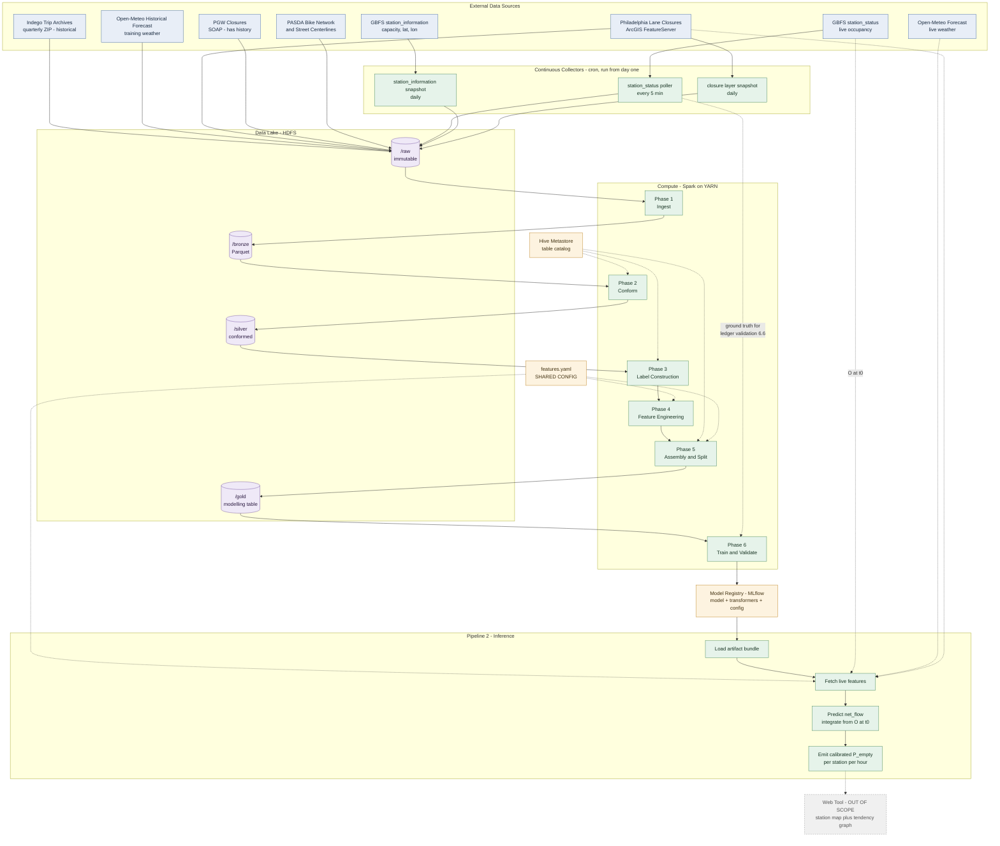
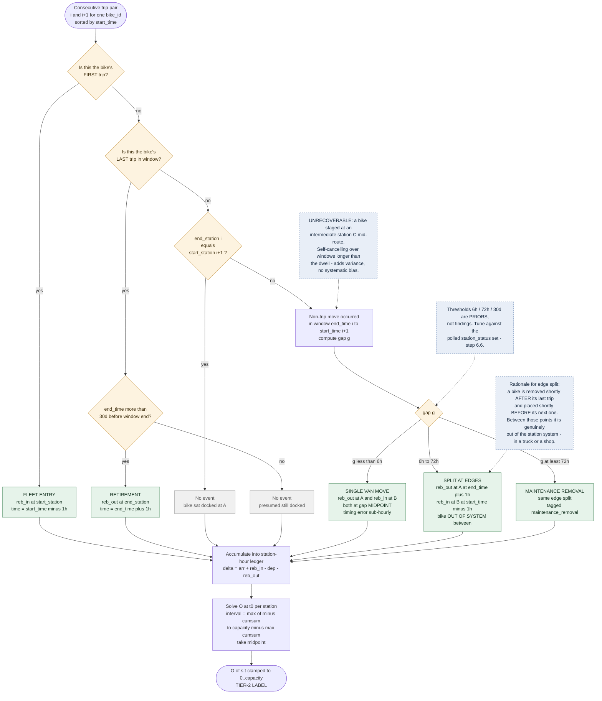

# Indego Station Capacity Prediction

Modelling the effect of **weather**, **time of day / day of week**, and **street closures** on dock capacity at Indego bikeshare stations in Philadelphia.

---

## 1. Objective

Quantify and predict how three external factors drive dock availability at each Indego station:

1. **Weather** — temperature, precipitation, wind, cloud cover
2. **Temporal** — hour of day, day of week, holidays, daylight
3. **Street closures** — permitted lane closures and utility work near the station

The deliverable is twofold:

- **Attribution** — the measured effect size of each factor group (this is the research question, not a by-product of prediction)
- **Prediction** — for a given station and hour, the probability that the station is empty or full

### Downstream consumer

A web tool (out of scope for this repository, documented here only to constrain the inference contract) will render a map of Indego stations showing current capacity. Clicking a station reveals a **capacity tendency graph**: probability of being empty as a function of time of day, conditioned on the model's factors. The web tool is a visualisation layer only — all logic lives in the inference pipeline.

---

## 2. Architecture

Diagrams are **Mermaid** source, held in `docs/` and embedded below. They render natively on GitHub and GitLab, and being plain text they diff and review like code rather than requiring a binary re-upload on every change.

| File | Diagram |
|---|---|
| `docs/architecture.mmd` | System architecture — sources, collectors, lake zones, compute, handoff |
| `docs/training_flow.mmd` | Pipeline 1 training logic, including decision gates and corrective loops |
| `docs/label_reconstruction.mmd` | Event-emission decision tree for steps 3.2 / 3.3 |

To export raster or vector copies if a static image is required:

```bash
npx -y @mermaid-js/mermaid-cli -i docs/architecture.mmd -o docs/architecture.svg
```

### 2.1 System Architecture

Storage zones, the three continuous collectors, and the two pipelines. Note that `features.yaml` is consumed by both pipelines, and the polled `station_status` log feeds training **only** at step 6.6 for ledger validation — never as a training feature.



### 2.2 Training Logic Flow

Pipeline 1 in execution order. Diamonds are decision gates; dashed edges are corrective loops that send work back to an earlier step. The three loops that matter are ledger-diagnostic failure → retune gap thresholds, leakage-audit failure → re-derive the feature, and baseline failure → revisit feature engineering.

```mermaid
flowchart TB

    START(["START - Pipeline 1"]) --> D05

    subgraph PH0["Phase 0 - Infrastructure"]
        direction TB
        D05["0.5 Start station_status poller<br/>DO THIS FIRST - lost days are unrecoverable"]
        A01["0.1 Provision HDFS zones<br/>raw / bronze / silver / gold"]
        A02["0.2 Provision Spark cluster"]
        A03["0.3 Stand up Hive Metastore"]
        A04["0.4 Author features.yaml<br/>pins vars, tz, buffer, thresholds"]
        D05 --> A01 --> A02 --> A03 --> A04
    end

    A04 --> B1

    subgraph PH1["Phase 1 - Ingest to Bronze"]
        direction TB
        B1["1.1-1.2 Download trip archives<br/>and station table"]
        B2["1.3 Snapshot station_information"]
        B3["1.4-1.6 Load closure history<br/>Streets bulk plus PGW historical"]
        B4["1.7 Pull PASDA geo layers"]
        B5["1.8 Backfill weather<br/>2-4 grid points, NOT per station"]
        B6["1.9 Land raw to Bronze Parquet"]
        B1 --> B2 --> B3 --> B4 --> B5 --> B6
    end

    B6 --> C1

    subgraph PH2["Phase 2 - Conform to Silver"]
        direction TB
        C1["2.1 Normalize trip schema<br/>explicit per-quarter mapping"]
        CQ{"Schema map covers<br/>every quarter?"}
        C2["2.2 Parse and localize timestamps<br/>America/New_York"]
        C3["2.3 Filter invalid trips<br/>drop Virtual Station, null, less than 60s, over 24h"]
        C4["2.4 Deduplicate on trip_id"]
        C5["2.5 Write silver.trips"]
        C1 --> CQ
        CQ -- "no" --> CFIX["Add mapping<br/>or drop that quarter"]
        CFIX -.-> C1
        CQ -- "yes" --> C2 --> C3 --> C4 --> C5
    end

    C5 --> L1

    subgraph PH3["Phase 3 - Label Construction"]
        direction TB
        L1["3.1 Build bike trajectories<br/>SINGLE GLOBAL PASS over all quarters<br/>Window partitionBy bike_id orderBy start_time"]
        LQ1{"end_station i<br/>equals<br/>start_station i+1 ?"}
        LNO["No event<br/>bike sat docked"]
        L2["3.2 Emit rebalancing events<br/>apply gap rules - see label_reconstruction"]
        L3["3.3 Emit fleet entry and exit events"]
        L4["3.4 Build full station-hour grid<br/>filtered by go-live date<br/>quiet hours are real zeros"]
        L5["3.5 Aggregate arr, dep, reb_in, reb_out"]
        L6["3.6 Compute net_flow = arr - dep<br/>TIER-1 LABEL - zero error"]
        L7["3.7 Estimate capacity<br/>rolling 90d max of O"]
        L8["3.8 Solve O at t0<br/>feasible interval midpoint"]
        LQ2{"Feasible interval<br/>non-empty?"}
        LFLAG["Flag station<br/>re-anchor at next<br/>quarter boundary"]
        L9["3.9 Reconstruct O, pct_full,<br/>is_empty, is_full<br/>TIER-2 LABEL - estimated"]
        L10["3.10 Ledger diagnostics"]
        LQ3{"Mass balance exact?<br/>Clamp rate low?<br/>Fleet curve smooth?"}
        LTUNE["Retune 6h / 72h / 30d<br/>gap thresholds"]

        L1 --> LQ1
        LQ1 -- "yes" --> LNO
        LQ1 -- "no" --> L2
        LNO --> L3
        L2 --> L3 --> L4 --> L5 --> L6 --> L7 --> L8 --> LQ2
        LQ2 -- "no" --> LFLAG --> L9
        LQ2 -- "yes" --> L9
        L9 --> L10 --> LQ3
        LQ3 -- "no" --> LTUNE
        LTUNE -.-> L2
    end

    LQ3 -- "yes" --> F1

    subgraph PH4["Phase 4 - Feature Engineering"]
        direction TB
        F1["4.1 Reproject ALL geometries to EPSG:2272<br/>never buffer in Web Mercator"]
        F2["4.2 Filter closures to bike-relevant<br/>intersect bike network"]
        F3["4.3 Expand permits to hourly intervals"]
        F4["4.4 Spatial join closures to stations<br/>buffer distance from features.yaml"]
        F5["4.5 Join weather on local-time hour"]
        F6["4.6 Derive calendar features<br/>cyclic sin/cos encoding for hour and weekday"]
        F7["4.7 Build lag and rolling features<br/>lag-1 is legitimate - available at serve time"]
        F8["4.9 Add station static features"]
        F9["4.8 LEAKAGE AUDIT<br/>every feature vs features.yaml"]
        FQ{"Any feature uses<br/>data from time later than t?"}
        FDROP["Drop or re-derive<br/>the offending feature"]

        F1 --> F2 --> F3 --> F4 --> F5 --> F6 --> F7 --> F8 --> F9 --> FQ
        FQ -- "yes" --> FDROP
        FDROP -.-> F9
    end

    FQ -- "no" --> G1

    subgraph PH5["Phase 5 - Assembly and Split"]
        direction TB
        G1["5.1 Assemble gold.station_hour_features<br/>approx 10M rows"]
        G2["5.2 TEMPORAL split - chronological cut<br/>NEVER random split"]
        G3["5.3 Fit encoders and scalers<br/>ON TRAIN SPLIT ONLY"]
        G4["5.4 Apply class weights<br/>is_empty is rare"]
        G5["5.5 Persist frozen splits"]
        G1 --> G2 --> G3 --> G4 --> G5
    end

    G5 --> T1

    subgraph PH6["Phase 6 - Train and Validate"]
        direction TB
        T1["6.1 Baseline<br/>mean by station, hour, weekday"]
        T2["6.2 Train net_flow regressor<br/>TIER-1 target"]
        T3["6.3 Train is_empty classifier<br/>calibrated probability"]
        T4["6.4 Tune on VAL only<br/>test stays sealed"]
        TQ1{"Beats baseline?"}
        TREV["Revisit features<br/>weather / closure arms<br/>may be contributing nothing"]
        T5["6.5 Evaluate on TEST - once"]
        T6["6.6 Validate ledger against<br/>polled station_status"]
        TQ2{"Reconstruction MAE<br/>acceptable?"}
        TDOC["Record error bar<br/>demote Tier-2 to<br/>feature-only if poor"]
        T7["6.7 SHAP attribution per factor group<br/>THIS IS THE RESEARCH DELIVERABLE"]
        T8["6.8 Export bundle<br/>model + features.yaml + transformers"]

        T1 --> T2 --> T3 --> T4 --> TQ1
        TQ1 -- "no" --> TREV
        TREV -.-> F1
        TQ1 -- "yes" --> T5 --> T6 --> TQ2
        TQ2 -- "no" --> TDOC --> T7
        TQ2 -- "yes" --> T7
        T7 --> T8
    end

    T8 --> MR(["Model Registry<br/>handoff to Pipeline 2"])

    classDef gate fill:#fdf3e0,stroke:#c08a2e,color:#40300f
    classDef crit fill:#fae6e6,stroke:#b04545,color:#3d1313
    classDef fix fill:#f7f0f0,stroke:#b04545,color:#3d1313,stroke-dasharray: 4 3

    class CQ,LQ1,LQ2,LQ3,FQ,TQ1,TQ2 gate
    class D05,L1,L6,F1,F9,G2,G3,T7 crit
    class CFIX,LFLAG,LTUNE,FDROP,TREV,TDOC fix
```



### 2.3 Label Reconstruction Decision Tree

The logic of steps 3.2 and 3.3, applied to each consecutive trip pair of a single `bike_id`. This is the highest-risk logic in the project and is drawn separately so it can be reviewed independently of the surrounding pipeline. Rules correspond to §5.4.



---

## 3. Scale and Tooling Rationale

State this explicitly, because it will be questioned.

| Quantity | Estimate |
|---|---|
| Trip records, 2022 Q1 – 2026 Q2 | ~4 M |
| Stations | ~250 |
| Hours in window | ~39,000 |
| Station-hour modelling grid | **~10 M rows** |

This is a **modest** volume that would fit on a single large machine. Distributed processing is justified by:

1. **Step 3.1** — a global sort-and-window over the entire trip history partitioned by `bike_id`. This is the genuine shuffle-heavy stage and the peak memory consumer.
2. **Step 4.3/4.4** — expanding closure permits to hourly intervals and spatially joining them to the station grid causes significant intermediate row multiplication.
3. The architectural requirement of the project itself.

It is **not** justified by raw input size. Be honest about this rather than overstating the data volume.

---

## 4. Data Sources

Full machine-readable inventory: **`indego_capacity_data_sources.csv`** (16 sources, endpoints, formats, auth requirements, caveats).

Summary of the primary sources:

| Source | Role |
|---|---|
| Indego Trip Data (quarterly CSV) | Complete event log of ridden movement. Basis of all label construction. |
| Indego GBFS `station_information` | Station capacity, latitude/longitude |
| Indego GBFS `station_status` | Live occupancy. Inference input + the only ground truth for validation. |
| Open-Meteo Historical Forecast | Training weather features |
| Open-Meteo Forecast | Inference weather features |
| Philadelphia Street Lane Closures | Permitted closures with effective date ranges |
| PGW Street Lane Closures | Gas-main utility closures (has a true historical method) |
| PASDA Bike Network / Street Centerlines | Determines which closures actually block a *cycling* route |

### Critical data gap

**There is no published historical archive of dock-level occupancy.** GBFS `station_status` is a live snapshot only. The label must therefore be reconstructed from trip data — see section 5.

---

## 5. Label Reconstruction

### 5.1 The problem

A naive `arrivals − departures` cumulative sum drifts badly, because van rebalancing moves bikes between stations without generating trip records.

### 5.2 Recovering rebalancing from `bike_id`

Sort all trips by `bike_id`, then `start_time`. For consecutive trips *i* and *i+1* of the same bike:

```
if end_station(i) != start_station(i+1):
    → a non-trip move occurred in the window (end_time(i), start_time(i+1))
```

This inference holds regardless of trip distance, round trips, or how far the bike travelled — trips are a complete log of *ridden* movement, so any unexplained displacement is a non-trip move.

### 5.3 What this does and does not recover

**Exact:** the net mass balance between endpoints A and B.

**Lossy:** intermediate dwells and timing. Specifically:

| Reality | What is missed |
|---|---|
| Van collects from A, holds in truck, docks at C, later moves to B | Station C's +1/−1 dwell is invisible |
| Bike pulled to the shop from A, returns to B 20 days later | Bike was in *no* station for 19 days |
| Van route: 8 bikes out of A, dropped across 4 stations | Mass balance correct, drop ordering unknown |
| Bike's first-ever / last-ever trip | No pair exists |

The intermediate-staging case is unrecoverable from trip data alone. It is self-cancelling over any window longer than the dwell, so it adds variance to hourly occupancy but **no systematic bias**.

### 5.4 Event emission rules

Do not emit a paired move at a single timestamp. Emit two independent events at the *edges* of the gap, because the physical priors are asymmetric — a bike is removed shortly *after* its last trip, and placed shortly *before* its next one. Between those points it is legitimately **out of the station system**.

| Gap `g` between `end_time(i)` and `start_time(i+1)`, A≠B | Emission |
|---|---|
| `g < 6h` | Single van move; `reb_out(A)` and `reb_in(B)` at gap midpoint |
| `6h ≤ g < 72h` | `reb_out(A)` at `end_time(i) + 1h`; `reb_in(B)` at `start_time(i+1) − 1h` |
| `g ≥ 72h` | Same split, tagged `maintenance_removal` |
| A = B, any `g` | No event — bike sat docked |
| First trip of a `bike_id` | `reb_in(start_station)` at `start_time − 1h` (fleet entry) |
| Last trip, `end_time` > 30d before window end | `reb_out(end_station)` at `end_time + 1h` (retirement) |
| Last trip, within 30d of window end | No event — presumed still docked |

**The 6h / 72h / 30d thresholds are priors, not findings.** Tune them against the polled validation set (step 6.6).

### 5.5 The ledger

For station *s*, hour *t*:

```
Δ(s,t) = arr(s,t) + reb_in(s,t) − dep(s,t) − reb_out(s,t)
O(s,t) = O(s,0) + Σ Δ(s,τ)   for τ ≤ t
```

`O(s,0)` is one unknown scalar per station. Solve by physical constraint: occupancy must satisfy `0 ≤ O(s,t) ≤ capacity(s)` for all *t*, which collapses to the interval:

```
[ max(−cumsum) , capacity − max(cumsum) ]
```

Take the midpoint. An empty interval indicates unrecovered mass errors — flag the station and re-anchor at the next quarter boundary.

Run the ledger as **one continuous pass across all quarters**, never per-file, so `bike_id` continuity survives quarter boundaries.

### 5.6 Two-tier labels

| Tier | Variable | Derivation | Error |
|---|---|---|---|
| **Tier 1** | `net_flow(s,t)` | `arr − dep`, counted directly from trip endpoints | **Zero.** No `bike_id` chaining, no initial condition, no timing assumptions. |
| Tier 2 | `O(s,t)`, `pct_full`, `is_empty`, `is_full` | Clamped cumulative ledger + solved `O(s,0)` | Estimated. Subject to all of 5.3. |

### 5.7 Target choice — and why

**Train on Tier-1 `net_flow` as the primary target.** Integrate to occupancy at inference time using the true current reading from `station_status`.

This is strictly better than training directly on reconstructed occupancy:

- The label carries zero reconstruction error
- At inference the true current occupancy *is* available, so the model only needs to predict the *change* — which is exactly what weather, time, and closures actually drive
- Reconstruction error does not propagate into learned weights

Retain reconstructed `O(s,t)` for two secondary purposes: as an **input feature** (a station already 90% full behaves differently), and as the basis of the **`is_empty` classifier**, which is what the web tool ultimately displays.

### 5.8 Known caveats

1. **Censoring.** When `O = 0`, departures are truncated; when `O = capacity`, arrivals are truncated. Observed flow understates true *demand*. If demand is the quantity of interest, use censored regression (Tobit) or train only on non-saturated hours. If realised capacity state is the target, censoring is acceptable as-is.
2. **Schema drift.** 2015–2017 files use different column names and lack `bike_type` and lat/lon. **Restrict training to 2022 Q1+** — consistent schema, post-COVID demand regime, e-bikes present, and aligned with Open-Meteo Historical Forecast coverage.
3. **Virtual Station.** Drop these rows before building the ledger; they are staff check-in/out artifacts and corrupt mass balance.
4. **Historical capacity is unavailable.** Only current capacity is published; stations have been resized and relocated. Use a rolling 90-day `max(O(s,t))` as the empirical estimate.

---

## 6. Pipeline 1 — Pre-Training

Steps are listed in **execution order**. Tool suggestions are recommendations only.

### Phase 0 — Infrastructure

| # | Step Name | Data Context (In → Out) | Reason | Suggested Tools |
|---|---|---|---|---|
| 0.1 | Provision distributed storage | — → empty `/raw`, `/bronze`, `/silver`, `/gold` zones | Spark requires a shared filesystem accessible to all executors; local disk breaks on a multi-node cluster. Zone layout enforces that raw data is never mutated in place. | HDFS; or S3 / MinIO if cloud |
| 0.2 | Provision compute cluster | — | Executes all subsequent Spark stages. Size for the `bike_id` global sort (3.1), the peak-memory stage. | Spark on YARN over HDFS; Spark standalone / EMR / Databricks |
| 0.3 | Stand up table catalog | — → schema registry | Lets later steps read `silver.trips` by name rather than path, so partition changes don't break downstream code. | Hive Metastore; Delta Lake or Apache Iceberg for ACID + time travel |
| 0.4 | Create shared feature-config file | — → `features.yaml` | The most common cause of train/serve skew is the inference path computing features slightly differently. One config, imported by both pipelines, pins variable lists, timezone, buffer distance, thresholds. | YAML + Pydantic, version-controlled |
| 0.5 | **Start `station_status` poller** | GBFS `station_status.json` → append-only log in `/raw/station_status/` | **Do this first, on day one.** No historical archive of dock occupancy exists. Every day of delay is validation data that can never be recovered. Runs in parallel with all other development. | Cron + Python, 5-min interval; land as dated JSON |

### Phase 1 — Ingest (Raw / Bronze)

| # | Step Name | Data Context (In → Out) | Reason | Suggested Tools |
|---|---|---|---|---|
| 1.1 | Download trip archives | `indego-trips-{YYYY}-q{N}.zip` ×18 → `/raw/trips/` | Immutable source of record. Download once, never re-fetch, so results reproduce even if Indego revises a file. | `requests` + checksums |
| 1.2 | Download station table | `indego-stations-*.csv` → `/raw/stations/` | Supplies `go live date`, required in 3.4 to avoid scoring pre-launch stations as zero-demand. | `requests`; re-scrape link (filename is date-stamped) |
| 1.3 | Snapshot station information | `station_information.json` → `/raw/gbfs_station_info/{date}/` | Supplies `capacity` and lat/lon. Dated, because capacity changes and you need a record of when each value was observed. | `requests`, daily cron |
| 1.4 | Bulk-load closure history | LaneClosure_Master CSV + GeoJSON → `/raw/closures/bulk/` | One-time backfill. Permit start/end dates allow retroactive reconstruction of a closure calendar. | ArcGIS Hub bulk download |
| 1.5 | Start closure daily snapshot | LaneClosure_Master query API → `/raw/closures/{date}/` | The layer is current-state; expired permits are deleted. Without dated snapshots, historical depth silently erodes. | Cron + `requests`, `f=geojson` |
| 1.6 | Pull PGW closures | `opendata.pgworks.com/EUN/` historical method → `/raw/closures_pgw/` | Utility closures are a major Philadelphia cause and are not fully mirrored in the Streets Dept layer. Has a true historical method, unlike 1.5. | `zeep` (Python SOAP client) |
| 1.7 | Pull geospatial reference layers | PASDA bike network + street centerlines → `/raw/geo/` | Static. Needed to distinguish closures blocking a cycling route from those affecting only motor traffic. | ArcGIS REST `/query`, paginated |
| 1.8 | Backfill weather | Open-Meteo Historical Forecast → `/raw/weather/` | Hourly features for the full training window. Fetch **2–4 grid points, not 250** — the reanalysis grid is ~11 km, so nearly all stations share a cell. Per-station calls are wasted quota and identical data. | `requests`, chunked by 6-month ranges, cached |
| 1.9 | Land raw → Bronze | All of the above → Parquet in `/bronze/` | Converts CSV/JSON/XML to columnar. Everything downstream reads Parquet; nothing re-parses raw text. | Spark `read` → `write.parquet`, partitioned by year/month |

### Phase 2 — Conform (Bronze → Silver)

| # | Step Name | Data Context (In → Out) | Reason | Suggested Tools |
|---|---|---|---|---|
| 2.1 | Normalize trip schema | 18 quarterly files with drifting column names → one unified schema | Pre-2018 files use different casing and column names and lack `bike_type`. Union fails or silently nulls without an explicit per-quarter mapping. | Spark; explicit per-quarter `dict` mapping, asserted not inferred |
| 2.2 | Parse and localize timestamps | string → `timestamp` in `America/New_York` | Every downstream join is on the hour. Naive local time breaks at DST — one hour duplicates in November, one vanishes in March. | Spark `to_timestamp`; set `spark.sql.session.timeZone` explicitly |
| 2.3 | Filter invalid trips | Drop `Virtual Station`, null stations, duration ≤ 60s or > 24h | Virtual Station rows are staff check-in artifacts and corrupt the Phase 3 mass balance. Sub-minute trips are dock-repick noise, not demand. | Spark `filter`; log counts dropped per rule |
| 2.4 | Deduplicate | Distinct on `trip_id` | Quarterly files overlap slightly at boundaries; a duplicated trip double-counts an arrival and breaks the ledger. | Spark `dropDuplicates` |
| 2.5 | Write `silver.trips` | → Parquet, partitioned by year/month | Clean conformed event log. All label construction reads from here. | Delta / Iceberg for schema enforcement |

### Phase 3 — Label Construction

| # | Step Name | Data Context (In → Out) | Reason | Suggested Tools |
|---|---|---|---|---|
| 3.1 | Build bike trajectories | `silver.trips` → per-`bike_id` ordered sequence with `lead()` columns | The core reconstruction. Must be a **single global pass across all quarters** — partitioning by quarter breaks `bike_id` continuity and injects a false rebalance event every 3 months. | Spark `Window.partitionBy("bike_id").orderBy("start_time")` + `lead()`; repartition by `bike_id` first |
| 3.2 | Emit rebalancing events | Rows where `end_station ≠ next_start_station` → `reb_out` / `reb_in` | Recovers van moves, invisible in trip data but responsible for most non-trip dock changes. Apply the gap rules in §5.4. | Spark `when`/`otherwise` on gap duration |
| 3.3 | Emit fleet entry/exit | First trip per bike → `reb_in`; last trip >30d before window end → `reb_out` | Without exit events, retired bikes inflate their last station's occupancy permanently. Without entry events, new bikes appear from nowhere. | Spark `first_value` / `last_value` over the same window |
| 3.4 | Build station-hour grid | `stations` × hourly calendar, filtered by `go live date` → complete grid | **Do not skip.** Hours with no activity are real zeros, not missing rows. Aggregating trips alone silently drops every quiet hour and biases the model toward busy periods. | Spark `sequence()` + `explode()` + cross join |
| 3.5 | Aggregate flows to station-hour | Events → `arr`, `dep`, `reb_in`, `reb_out` per (station, hour) | Reduces ~4 M events onto the ~10 M-row modelling grid. | Spark `groupBy` + `agg`, left-joined onto 3.4 with `fillna(0)` |
| 3.6 | Compute `net_flow` | `arr − dep` | **Tier-1 label.** Exact, no reconstruction error, no initial condition. The training target. | Spark column expression |
| 3.7 | Estimate capacity | Rolling 90-day `max(O)` per station, cross-checked against GBFS `capacity` | Historical capacity is not published and stations have been resized. Fixed current capacity misstates `pct_full` for earlier periods. | Spark rolling window |
| 3.8 | Solve initial occupancy | Cumulative `Δ` per station → feasible interval, take midpoint | `O(s,0)` is one unknown scalar per station. The constraint `0 ≤ O ≤ capacity` pins it without external data. | Spark `Window.rowsBetween(unboundedPreceding, currentRow)` |
| 3.9 | Reconstruct occupancy | → `O(s,t)`, `pct_full`, `is_empty`, `is_full` | **Tier-2 label**, plus the "how full is it already" input feature. `is_empty` is what the web tool visualises. | Spark cumulative sum + clamp |
| 3.10 | Run ledger diagnostics | → QA report | Three checks that catch bugs before they reach the model — see §8. | Spark aggregations → Great Expectations or notebook report |

### Phase 4 — Feature Engineering

| # | Step Name | Data Context (In → Out) | Reason | Suggested Tools |
|---|---|---|---|---|
| 4.1 | Reproject all geometries | Everything → **EPSG:2272** (PA State Plane South) | The closure CSV export is EPSG:3857, where distances inflate ~1.29× at Philadelphia's latitude. Buffering in Web Mercator gives silently wrong radii. Project to a local planar CRS once, up front. | GeoPandas / Apache Sedona, `to_crs(2272)` |
| 4.2 | Filter closures to bike-relevant | Closures ⋈ bike network → flagged subset | Most lane closures don't affect cyclists. Unfiltered, the closure feature is mostly noise and the model learns nothing from it. | Sedona `ST_Intersects` / `ST_DWithin` |
| 4.3 | Expand permits to hourly intervals | One row per permit → one row per active hour | Converts a permit record into something joinable to the station-hour grid. | Spark `sequence()` + `explode()` on start/end dates |
| 4.4 | Spatial join closures → stations | Closure-hours ⋈ stations within buffer → `n_closures_nearby`, `closed_bike_lane_m` | Links the closure signal to the station grid. **Buffer distance is a design decision** — 150 m is a reasonable start; treat as a hyperparameter and test sensitivity. | Apache Sedona (distributed) or GeoPandas (fits in memory at this scale) |
| 4.5 | Join weather | Weather-hours ⋈ station-hours on nearest grid point + hour | The weather arm of the hypothesis. Join on local-time hour to match 2.2. | Spark broadcast join (weather table is tiny) |
| 4.6 | Derive calendar features | → `hour_of_day`, `day_of_week`, `is_weekend`, holidays, daylight flag | The time-of-day / day-of-week arm. Encode hour and weekday **cyclically** (sin/cos) so hour 23 is adjacent to hour 0 rather than maximally distant. | Python `holidays`; sunrise/sunset from the weather pull |
| 4.7 | Build lag and rolling features | → `O(s,t−1)`, flow same hour last week, rolling 7d mean | Strong predictors, and legitimate: at inference the true current occupancy comes from `station_status`, so lag-1 is genuinely available at serve time. | Spark `Window.orderBy("hour")` with `lag()` |
| 4.8 | Leakage audit | Every feature → pass/fail | Any feature using data from time > *t* is unavailable at inference and produces a model that looks excellent offline and fails live. Audit each feature's time dependency explicitly. | Manual checklist against `features.yaml` |
| 4.9 | Add station static features | Bike-lane density, dock count, neighborhood, distance to centroid | Lets the model generalise across stations rather than memorise each one — necessary for handling newly added stations. | Sedona spatial aggregation |

### Phase 5 — Assembly and Split

| # | Step Name | Data Context (In → Out) | Reason | Suggested Tools |
|---|---|---|---|---|
| 5.1 | Assemble modelling table | All features + labels → `gold.station_hour_features` | Single wide table, ~10 M rows. The one artifact the training job reads. | Spark → Parquet, partitioned by year/month |
| 5.2 | **Temporal** train/val/test split | Chronological cut — e.g. train ≤ 2025 Q2, val 2025 Q3–Q4, test 2026 Q1–Q2 | **Never random-split.** Random splitting leaks future weather and future station behaviour into training and badly inflates metrics. A chronological split is the only honest estimate of live performance. | Spark filter on date; no shuffle |
| 5.3 | Fit encoders and scalers | Train split only → fitted transformers | Fitting on the full dataset leaks test-set statistics. Fit on train, apply to val/test. | Spark ML `Pipeline`; persist fitted objects |
| 5.4 | Handle class imbalance | `is_empty` positive rate is low | Stockouts are rare relative to normal hours. Untreated, a classifier scores high accuracy by never predicting "empty" — useless for the tool. | Class weights (preferred over resampling for time series) |
| 5.5 | Persist splits | → `/gold/train/`, `/val/`, `/test/` | Frozen inputs, so model comparisons are like-for-like across experiments. | Parquet; record row counts and date ranges |

### Phase 6 — Train and Validate

| # | Step Name | Data Context (In → Out) | Reason | Suggested Tools |
|---|---|---|---|---|
| 6.1 | Establish baselines | → baseline metrics | Historical mean by (station, hour, weekday) is a strong, cheap baseline. If the full model can't beat it, weather and closures aren't contributing — and you need to know that early. | Spark SQL |
| 6.2 | Train `net_flow` regressor | Train split → model | Tier-1 target. Predicting change rather than level keeps reconstruction error out of the learned weights. | LightGBM / XGBoost; Spark MLlib GBT if cluster-native is required |
| 6.3 | Train `is_empty` classifier | Train split → model | Directly produces the probability the web tool displays. Must be a calibrated probability, not a point estimate. | LightGBM `objective=binary`; Platt / isotonic calibration on val |
| 6.4 | Tune hyperparameters | Val split → best config | Uses val only. Test stays sealed. | Optuna; time-series CV with expanding window |
| 6.5 | Evaluate on test | Test split → final metrics | The only numbers reported. Evaluate once, at the end. | MAE / RMSE for flow; PR-AUC and Brier score for stockout |
| 6.6 | **Validate the ledger** | Polled `station_status` (from 0.5) ⋈ reconstructed `O(s,t)` | The honest error bar on the Tier-2 label, and the only direct test of whether `bike_id` rebalancing recovery works. Requires the trip CSV covering the polling window, published quarterly. | Spark join + per-station MAE |
| 6.7 | Interpret and attribute | → SHAP values per feature group | The research question is about the *effect* of weather, time, and closures — not only prediction accuracy. Attribution is a deliverable, not a nice-to-have. | SHAP; partial dependence plots |
| 6.8 | Export artifacts | → model binary + `features.yaml` + fitted transformers | The inference pipeline must load exactly these. Versioned together, since a model and its preprocessing are one unit. | MLflow Model Registry; ONNX if the serving stack differs |

---

## 7. Pipeline 2 — Inference

> **[TO BE DETAILED]** — to be specified in the same tabular form as Pipeline 1.

Contract fixed by Pipeline 1:

- Loads the artifact bundle from 6.8: model binary + `features.yaml` + fitted transformers
- Reads live `station_status` for the integration constant `O(s,t₀)`
- Reads live Open-Meteo Forecast using the **identical variable list** pinned in `features.yaml`
- Reads the current closure layer, buffered at the **same distance** used in 4.4
- Derives calendar features from **shared code** with 4.6
- Predicts `net_flow` forward, integrates from `O(s,t₀)`, and emits calibrated `P(empty)` per station per hour

Live data is used **only** at inference. It is never a training input.

---

## 8. Quality Gates

### Ledger diagnostics (step 3.10)

| Check | Expected | Failure meaning |
|---|---|---|
| Global mass balance | `Σ reb_in == Σ reb_out` exactly, by construction | Pairing logic bug |
| Clamp violation rate | Low single-digit % per station | Timing error; concentrates at stations with heavy van activity |
| Out-of-system fleet count over time | Smooth few-% of fleet with a maintenance-shaped seasonal bump | A sawtooth means the 6h / 72h thresholds are mis-set |

### Modelling gates

- Chronological split only (5.2)
- Transformers fitted on train split only (5.3)
- Leakage audit passed for every feature (4.8)
- Full model beats the (station, hour, weekday) mean baseline (6.1)

---

## 9. Highest-Risk Items

1. **Step 0.5 — start the `station_status` poller today.** It gates step 6.6 entirely, and 6.6 is what makes the reconstruction defensible. Lost days are unrecoverable.
2. **Step 3.1 — the global `bike_id` pass.** The one stage where a partitioning mistake produces plausible-looking but wrong output that no downstream check will obviously catch.
3. **Step 4.1 — CRS handling.** Buffering in the wrong projection yields silently incorrect closure features, and the model will simply learn nothing from the closure arm.
4. **PennDOT RCRS credentials.** Requires a Data Feed Request Form with unknown lead time. Submit early if that source is in scope.

---

## 10. Repository Layout

```
.
├── README.md
├── indego_capacity_data_sources.csv    # Source inventory
├── features.yaml                       # Shared feature config (0.4)
├── docs/
│   ├── architecture.mmd                # Mermaid - system architecture
│   ├── training_flow.mmd               # Mermaid - Pipeline 1 logic
│   └── label_reconstruction.mmd        # Mermaid - step 3.2/3.3 decision tree
├── collectors/                         # Continuous cron jobs (0.5, 1.3, 1.5)
├── pipelines/
│   ├── ingest/                         # Phase 1
│   ├── conform/                        # Phase 2
│   ├── labels/                         # Phase 3
│   ├── features/                       # Phase 4
│   ├── assembly/                       # Phase 5
│   └── training/                       # Phase 6
├── inference/                          # Pipeline 2
└── tests/
```

---

## 11. Open Decisions

| Decision | Status |
|---|---|
| Closure→station buffer distance (150 m starting point) | Open — treat as hyperparameter |
| Gap thresholds 6h / 72h / 30d | Open — tune against polled validation set |
| Training window start (2022 Q1 recommended) | Open |
| Demand vs. realised-flow modelling (censoring treatment) | Open — see §5.8.1 |
| PennDOT RCRS in or out of scope | Open — depends on credential lead time |
| Compute stack (Spark/YARN/HDFS vs. managed) | Open |
